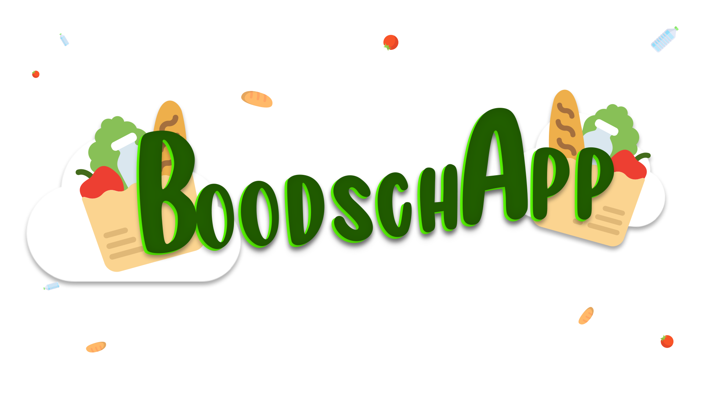

# De BoodschApp | 2022 | Novi College | Eindopdracht Full Stack Developer

Dit is de backend voor mijn applicatie "de BoodschApp".

[Mijn Github voor de BACK-END vind je hier](https://github.com/BayramaliDilek/BoodschApp-Backend-V3)

[Mijn Github voor de FRONT-END vind je hier](https://github.com/BayramaliDilek/BoodschApp-Frontend-V3)

## Applicatie starten

Aangezien je de 'ReadMe' al aan het lezen bent ga ik ervanuit dat het clonen van de repository gelukt is. 
if not, hierbij de links;

- HTTPS: `https://github.com/BayramaliDilek/BoodschApp-Backend-V3.git`
- SSH: `git@github.com:BayramaliDilek/BoodschApp-Backend-V3.git`

## Bestanden in mijn Backend-Project.

### Main
- BoodschAppBackendV3Application (main)

### Controllers
- AuthenticationController
- DeliveryRequestController
- ExceptionController
- PersonController
- PhotoController
- ProductController
- UserController

### Dtos
- DeliveryRequestDto
- DeliveryRequestInputDto
- DeliveryRequestStatusDto
- PersonDto
- PersonInputDto
- ProductDto
- ProductInputDto

### Repositories
- DeliveryRequestRepository
- FilUploadRepository
- PersonRepository
- ProductRepository
- UserRepository

### Service/ServiceImpl
- CustomUserDetailService
- DeliveryRequestService
- DeliveryRequestServiceImpl
- PersonService
- PersonServiceImpl
- PhotoService
- ProductService
- ProductServiceImpl
- UserService
- UserServiceImpl

### Models
- Authority
- AuthorityKey
- DeliveryRequest
- FileUploadResponse
- Person
- Product
- Status
- User

### Payload
- AuthenticationRequest
- AuthenticationResponse

### Utils
- JwtUtil
- RandomStringGenerator

### Filter
- JwtRequestFilter

### Exceptions
- BadRequestException
- RecordNotFoundException
- UsernameNotFoundException
- UsernameAlreadyExistException

# Gebruikers & Rollen

De volgende gebruikers kunnen gebruikt worden om de applicatie te runnen/testen.

#### ADMIN_ROLE 
- gebruikersnaam: admin
- wachtwoord: password

#### USER_ROLE
- gebruikersnaam: hans
- wachtwoord: password

## Wie.. wat.. hoe?

Er zijn een heleboel zieken die in deze moeilijke tijden zelf geen boodschappen kunnen en/of
mogen doen. Dit vinden wij niet kunnen en hebben daar nu de perfecte oplossing voor!

Wij bieden mensen die ziek thuis zitten de gelegenheid gebruik te maken van ons platform om zo
in contact te komen met mensen die zichzelf
aanbieden als 'bezorger'. Zo kunnen zij alsnog boodschappen doen.. ...maar dan online!

Je kunt heel makkelijk kiezen uit ons assortiment welke producten je nodig hebt. Deze voeg je toe in je winkelwagen en
worden ze thuis bij je
bezorgd door één van de bezorgers die zich heel goed houden aan de voorzorgsmaatregelen die we handhaven i.v.m. corona. Mondkapjes
en de handschoenen staan paraat!

###### Eindopdracht Full-Stack Developer NOVI College | Bayramali Dilek | Copyright © 2022 BoodschApp | Alle Rechten Voorbehouden.